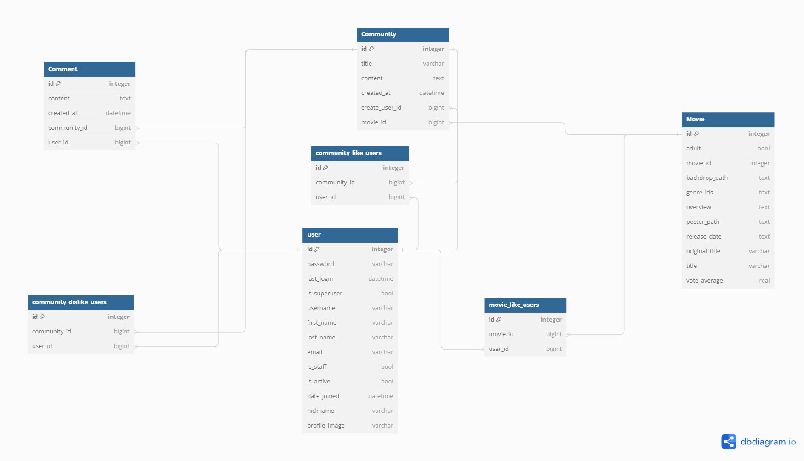
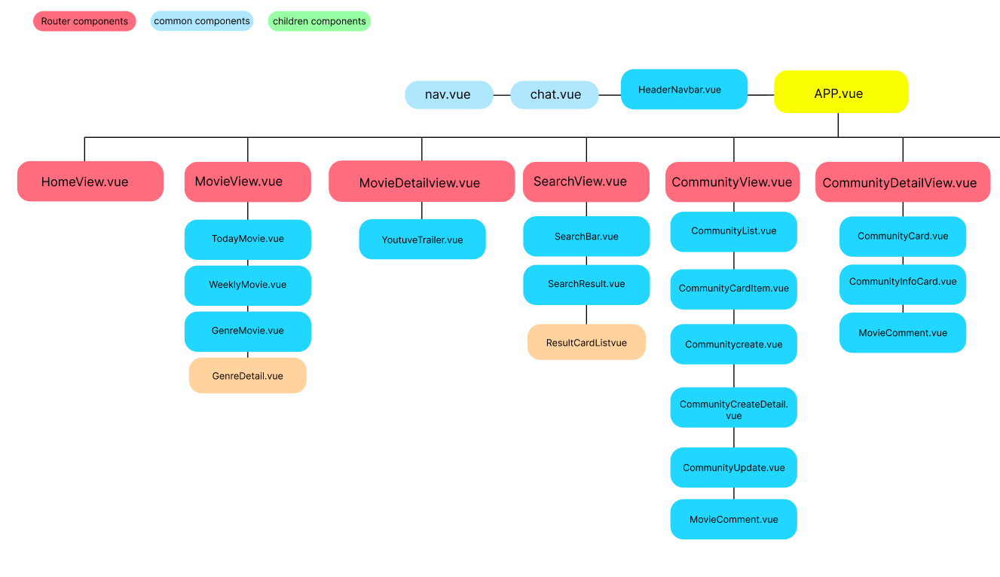
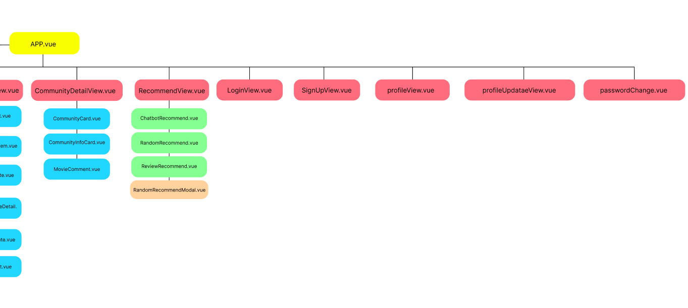
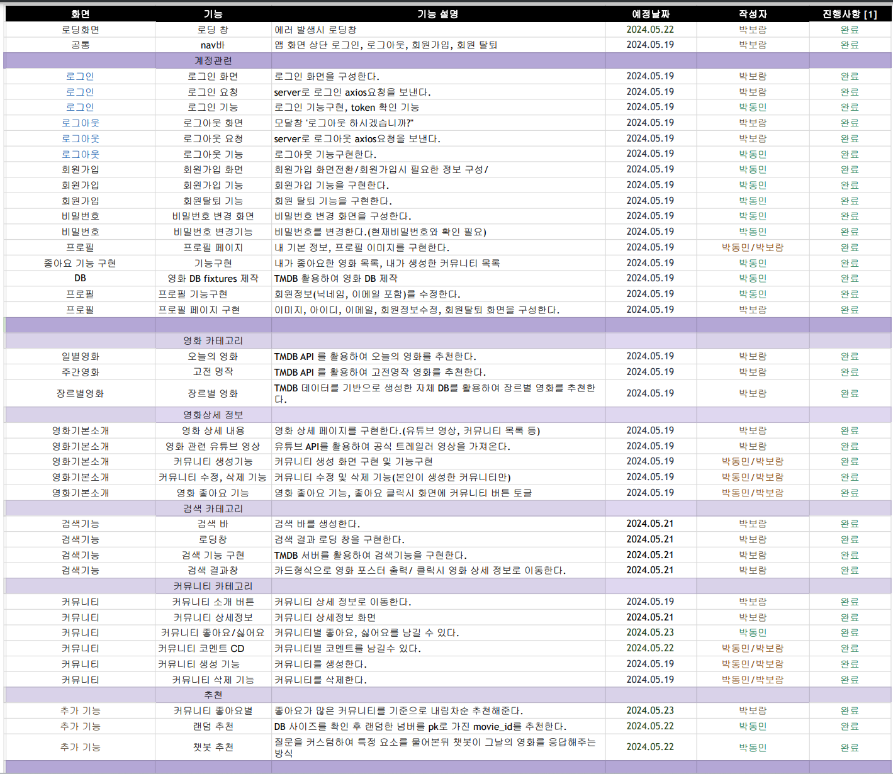

# SSAFY_영화추천서비스_관통pjt
 2024_05_16 ~2024_05_23

## 0. 서비스명
### Marsh Movie
- 서비스 설명
    - 쉬는 시간(Snack Time)에 간편하게 영화 추천을 받을 수 있는 서비스입니다.
- 컨셉
    - 마쉬멜로의 마쉬(Marsh)와 영화(Movie)의 합성어
    - 캠핑장에 온 캠퍼(Camper)가 모닥불에 둘러 앉아 이야기를 나누는 컨셉(Potluck)

## 1.팀원 정보 및 업무 분담 내역
- 박보람 [ FRONT ] (Front: 80% / Back: 20%)
    - CSS, Bootstrap4, Vue.js
    - TMDB api를 활용한 영화 정보 조회 및 검색
    - 커뮤니티 CRUD 기능 구현
    - 리뷰 추천(핫 리뷰) 기능 구현

- 박동민 [ BACK ] (Front: 20% / Back: 80%)
    - Django API Server, API를 활용한 Data Seeding(DB) 구현
    - 유저 정보 관리 기능 구현(회원가입/탈퇴, 로그인/로그아웃, 프로필 페이지)
    - 커뮤니티 CRUD 기능 구현
    - 랜덤 영화 추천 기능, 챗봇(GPT)에게 영화 추천받는 기능 구현
    - 그 외 Backend 관련 작업

  
## 2. 기획의도 및 목표
- 영화 정보를 조회할 수 있다.
    - TMDB 데이터와 API를 기반으로 오늘의 영화를 조회할 수 있다.
    - TMDB 데이터와 API를 기반으로 고전 명작을 추천받을 수 있다.
    - 자체 데이터베이스를 활용하여 장르별 영화를 추천받을 수 있다.
- 영화 정보를 검색할 수 있다.
    - TMDB API기반으로 영화 정보를 검색할 수 있다.
- 커뮤니티 기능을 이용할 수 있다.
    - 본인이 좋아요한 목록을 바탕으로 Pot이라는 커뮤니티 글을 게시할 수 있다.
    - 게시글 생성 후 똑같은 영화를 좋아요한 유저들끼리 댓글을 통해 소통할 수 있다.
    - 생성만 가능하고, 댓글 수정은 할 수 없다.(한 번 뱉은 말은 다시 담을 수 없음에서 착안)
    - 커뮤니티 글에 좋아요와 싫어요를 할 수 있다.(본인이 체크한 결과 확인 가능)
- 추천 기능
    - 베스트리뷰 추천(핫 리뷰)
        - 생성된 커뮤니티 중 좋아요를 가장 많이 받은 순서대로 영화를 추천한다.
    - 랜덤 추천
        - DB의 크기를 계산 후 해당 범위 내에서 숫자 1개를 랜덤으로 추출하여 그 숫자를 기반으로 영화를 추천한다.
    - 챗봇 추천
        - 장르, 나이, 성별, 오늘의 기분을 입력하여 챗봇에게 영화를 추천받는다.

## 3. 개발환경
- Python
    - Python 3.6.7
    - django 2.1.8
- Javscript
    - ES6
    - Vue.js
    - dependencies
        - "axios": "^1.6.8",
        - "bootstrap": "^5.3.3",
        - "bootstrap-icons": "^1.11.3",
        - "js-cookie": "^3.0.5",
        - "pinia": "^2.1.7",
        - "pinia-plugin-persistedstate": "^3.2.1",
        - "vue": "^3.4.21",
        - "vue-router": "^4.3.0",
        - "vue3-carousel": "^0.3.3"
        - "vite": "^5.2.8"

- Database
    - sqlite3
   

## 4. 개요
- 본 서비스는 TMDB API를 활용하여 데이터를 수집, 가공하여 데이터 베이스에 저장하였다.
- 웹서비스를 위주로 반응형 웹은 고려하지 않았으며, 최신 UI 기술 도입에 초점을 두었다.
- Django REST Framework를 활용하여 URL 렌더링 및 기본 템플릿을 사용하였으며 메인 기능은 하나의 페이지에서 Vue.js 를 사용, SPA 유사하게 구현하였다.
- 영화 추천의 경우 주어진 영화와 비슷한 영화를 추천하는 방식으로 설계되었다

- DB ERD
  

- Components
  
  

- 요구사항 
    

- 프로젝트 구조
   

       
구조 확인

       

        ├─final-pjt-back
        │  ├─accounts
        │  │  ├─migrations
        │  │  │  └─__pycache__
        │  │  └─__pycache__
        │  ├─final_pjt
        │  │  └─__pycache__
        │  ├─media
        │  │  └─profile_images
        │  └─movies
        │      ├─fixtures
        │      ├─migrations
        │      │  └─__pycache__
        │      └─__pycache__
        └─final-pjt-front
            ├─.vscode
            ├─public
            └─src
                ├─assets
                ├─components
                │  ├─common
                │  ├─community
                │  ├─movie
                │  └─Recommend
                ├─router
                ├─stores
                └─views

   </detail>

### 🎯 요구 사항
- 구현성공 ⭕
- 구현실패 ❌
- 필수 요구사항 ✅
- 추가로 구현 한 기능 💖

1. 영화 데이터 ⭕ ✅
2. 영화 추천 알고리즘 ⭕ ✅
3. API ⭕ ✅
4. 커뮤니티 ⭕ ✅
5. README ⭕ ✅
6. Ai Chat bot 기능 ⭕💖
7. 랜덤 영화 추천 알고리즘 ⭕💖
8. 좋아요 생성된 커뮤니티 기반 영화추천 알고리즘 ⭕💖

## 영화 추천 기능(기능 상세 설명)
- ### 장르별 추천
    - v-for을 사용하여 genreList에 담긴 장르의 값을 담은 버튼들을 만든다.
    - 버튼을 클릭하면 RouterLink를 통해 genreId를 갖고 genredetail로 이동한다.
    - 해당 장르인 영화들(genreMovies)의 포스터를 carousel 형태로 출력한다.
    - bootstrap의 Navigation component를 사용하여 포스터를 넘길 수 있게 한다.
    - 영화 포스터를 클릭하면 해당 영화의 상세 정보가 담긴 페이지로 이동한다.
    

       
기술 구현 코드

       

        // GenreMovie.vue > template

        <button
            class="btn scroll-item"
            v-for="genre of genresList"
            :key="genre.id"
            @click="showGenre(genre.id)"
        >
            {{ genre.name }}
        </button>

        // GenreMovie.vue > script

        const showGenre = (id) => {
            router.push({ name: 'genredetail', params: { genreId: id } });
        }

        // GenreDetail.vue > template

        
          
            <Carousel v-bind="settings" :breakpoints="breakpoints">
                <Slide v-for="movie in genreMovies" :key="movie.id">
                    

                    
                    

                </Slide>

                <template #addons>
                    <Navigation/>
                </template>
            </Carousel>
        

        // GenreDetail.vue > script

        const getMoviePoster = movie => {
            if (movie.poster_path) {
                return imgBaseURL + movie.poster_path
            } else {
                return emptyPopcornBox
            }
        }

        const goDetail = function (movieId) {
            console.log('클릭')
            router.push({ name: 'moviedetail', params: { movieId: movieId } })
        }
    </detail>

- ### 영화 상세정보 접근시 DB와 비교
    - 로그인 후 기능 이용을 전제로 하고 있기에, 로그인 여부를 체크한다.
    - 해당 영화의 movie_id를 받아와 DB에 존재하는지 체크한다.
    - 존재한다면(try) 영화가 이미 존재한다는 메시지를 보낸다.
    - 존재하지 않는다면 요청시 받은 데이터를 이용해 유효성 검사를 진행한다.
    - 유효한 경우에만 DB에 정보를 저장하고 되돌아간 다음, 상세 정보가 담긴 페이지를 출력한다.
    

       
기술 구현 코드

       

        // movies > views.py

        @api_view(['POST'])
        @permission_classes([IsAuthenticated])
        def db_check(request, movie_id):
            try:
                movie = Movie.objects.get(movie_id=movie_id)
                return Response({'message': 'Movie already exists.'}, status=status.HTTP_200_OK)
            except Movie.DoesNotExist:
                serializer = MovieCreateSerializer(data=request.data)
                if serializer.is_valid():
                    serializer.save()
                    return Response(status=status.HTTP_201_CREATED)
                return Response(serializer.errors, status=status.HTTP_400_BAD_REQUEST)
    </detail>

- ### 랜덤 추천
    - RandomRecommend component에서 '오늘의 영화 뽑기' 버튼을 클릭하면 modal이 열린다.
    - onMounted로 modal창이 열리며 영화 DB의 크기를 계산하고 가져온다.
    - '번호 뽑기' 버튼을 클릭하면 generateRandomNumber함수를 실행한다.
        - 0부터 DB 크기 사이의 랜덤한 수 하나를 뽑아 보여준다.
        - DB에 있는 영화들 중 해당 수를 pk값으로 가진 영화의 movie_id를 가져온다.
    - '영화 정보 보러 가기' 버튼을 클릭하면 가져온 movie_id 값을 갖는 영화의 상세 정보 페이지로 이동한다.
        - MovieDetailView로 이동되지만, 로그인이 되어 있지 않으면 정보 확인이 불가능하다.
    

       
기술 구현 코드

       

        // RandomRecommend.vue > template

        <button
            type="button"
            class="btn"
            style="background-color:#ff9d3d; color : white;"
            @click="generateRandomNumber"
            data-bs-toggle="modal"
            data-bs-target="#random-number"
        >
            오늘의 영화 뽑기
        </button>

        // RandomRecommen.vue > script

        const fetchDbSize = function () {
        axios({
            method: 'get',
            url: `${store.API_URL}/marshmovie/get_db_size/`
        })
            .then(response => {
            dbSize.value = response.data.dbsize
            })
            .catch(error => {
            console.error('There was an error fetching the DB size:', error)
            })
        }

        const generateRandomNumber = function () {
            if (dbSize.value > 0) {
                randomNumber.value = Math.floor(Math.random() * dbSize.value) + 1;
            }

            const loadMovieId = function () {
                axios({
                    method: 'get',
                    url: `${store.API_URL}/marshmovie/movie-id-info/${randomNumber.value}/`
                })
                .then(res => {
                    movieId.value = res.data.value
                })
                .catch(err => {
                    console.log(err)
                })
            }

            loadMovieId()
        }
    </detail>

- ### 챗봇 추천
    

       
기술 구현 코드

       

        ├─final-pjt-back
  
                ├─stores
                └─views

    </detail>

-  ### 기타(기억에 남는 부분 > 커뮤니티 좋아요 기능)
    

       
기술 구현 코드

       

        ├─final-pjt-back
  
                └─views

    </detail>

## 👍 배운점 및 느낀점

- 박보람 : 기초가 많이 부족함을 느꼈습니다. 특히 lifecycle hook 에 대한 이해 없이 렌더링 시점의 오류를 잡기 위해 많은 시간을 쏟았습니다. 
장르별 영화 추천을 위해 컴포넌트 구조를 짤때 라우터 뷰의 children 관계에 대한 이해가 부족하여 기능을 구현하는 데 어려움을 겪었습니다. 이 문제는 movie component 하위에 genreDetail을 배치함으로써 해결했는데, 비록 시간은 오래 걸렸지만 이 과정에서 화면 구조에 대한 이해도를 높일 수 있었습니다. 또한, 프론트에서 back으로 axios 요청을 보낼때, 사용자 인증 정보를 state 관리를 통하여 전달하는 과정에서 token 값을 다룰때 변수에 담는 부분에서 오류가 자주 발생하였습니다. 기능별로 컴포넌트를 쪼개려고 시도하였는데, 불필요하게 컴포넌트가 많아지면서 오히려 작업과정에 오류가 발생하였던 점이 아쉬움이 남습니다. 기획 및 설계과정에서 좀 더 잘 접근해야할 필요성을 느꼈습니다.

- 박동민 : 함께 작업하는 사람들과의 협업이 상당히 중요하다는 점을 느꼈습니다. Postman을 사용해 Django에서 작성한 코드의 정상 작동을 확인했음에도 불구하고, Vue와 함께 작동시켜 결과를 확인해보면 에러가 나는 경우가 상당히 많았습니다. 또 git을 사용하다보니 conflict가 나는 경우가 많아 서로가 어느 부분을 수정했는지에 대해서도 파악할 필요가 있었습니다. 에러 메시지를 많이 보면서 문제점을 해결하기 위해 노력하다보니 개발자 도구를 사용하는 법도 늘었고, 명확한 답을 얻기 위해 구체적으로 질문하는 습관도 갖게 되었습니다. 과정은 힘들었지만 완성된 결과물을 보고 나니 뿌듯했고, 좀 더 발전시켜 누가 봐도 잘 만들었다 싶은 사이트로 발전시켜보고 싶다는 생각이 들었습니다.

## 📁 오픈소스 출처
- TMDB : https://developer.themoviedb.org/reference/intro/getting-started 
- GPT : https://openai.com/index/openai-api/

